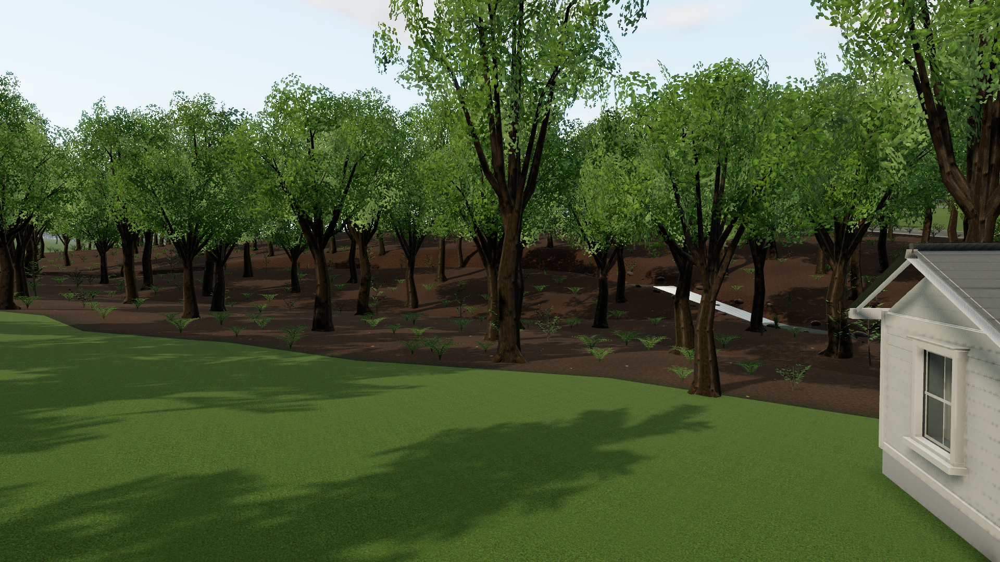
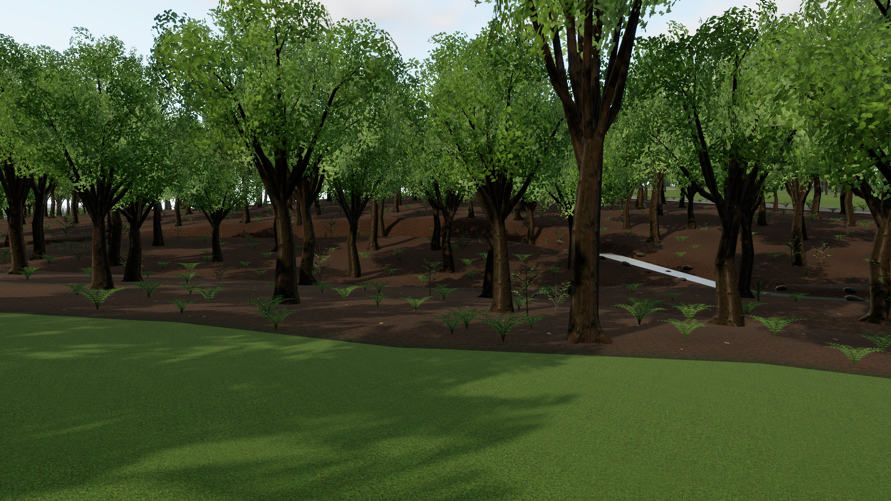
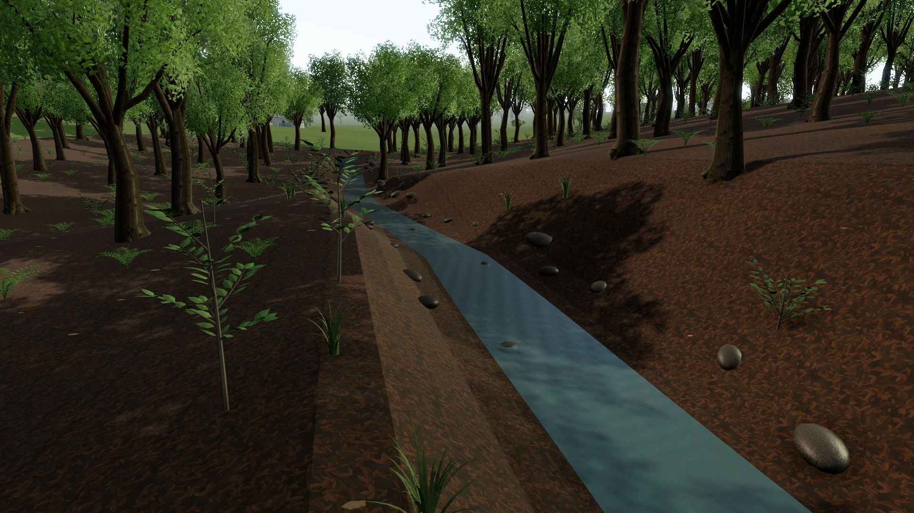

# Home woods and Stony Creek

The backyard pass reconstructs the open lawn, woodland edge and creek behind **2 Beverly Drive**. Official leaf-off aerials establish where the woods begin; USGS hydrography establishes the named stream and its horizontal course. The game adds an inferred ravine and detailed woodland scenery around that mapped layout.



## What the sources establish

The creek is **Stony Creek**, USGS 3DHP **EH86B**, GNIS **966557**, corresponding to NHD permanent ID **61784457**. The full **33-point source centerline** is retained in the compiled map. Approximately **212.3m** is rendered inside the inspected backyard area, following and resampling those original segments. The visible reach ends before West Ridge pavement; the road geometry and surface remain intact. [USGS 3DHP source](https://hydro.nationalmap.gov/arcgis/rest/services/3DHP_all/MapServer/50), [NHDPlus HR source](https://hydro.nationalmap.gov/arcgis/rest/services/NHDPlus_HR/MapServer/3).

[OSM way 1231197326](https://www.openstreetmap.org/way/1231197326) follows the same broad corridor and southwest bend. The official NYS aerials provide visual corroboration. A separately examined DEC classification line is displaced approximately 30m west around Home's north/south position and was not chosen as the detailed placement source. The 3DHP record is dated 2023 but retains NHD-derived geometry closely matching the older record; it is not evidence of a new survey. [Hydrography research](research-backyard/hydro-findings.md) records source dates, identifiers and the cross-checks.

The [2013 and 2025 NYS aerial comparison](research-backyard/woodland-findings.md) supports a broad deciduous woodland behind the Beverly lawns. Near Home's Z≈0, the maintained lawn reaches roughly **27m behind the rear wall** before the irregular leaf-litter boundary. The new woodland polygon follows that transition and preserves nearby lawns and buildings. The original pixels and returned georeference are retained in [woodland-observations.json](research-backyard/woodland-observations.json); edge uncertainty is approximately 3m and greater where branches or shadows obscure it. Individual interior trunks were not measured from the tangled leaf-off crowns.



## Terrain and channel interpretation

The local terrain patch has **241 × 321 vertices** at approximately **0.74m spacing**. It subdivides the existing coarse USGS DEM and carves a representative ravine. **It does not contain newly surveyed or higher-resolution elevation measurements.**

The original roughly 30m elevation cells produce an approximately 2.1m uphill hump along the mapped downstream course. A consistently descending water profile corrects that visual contradiction; the game lowers a bed and sloping banks beneath it. The inferred lowering reaches about **2.7m below the original terrain** at the deepest point. Water depth is approximately **0.2m** near the channel center, and width varies around **2.2m**. Actual bank heights, bed shape, channel width, water level and small branch-obscured bends remain unmeasured. These parameters create a plausible small wooded creek rather than claiming a surveyed cross-section.

The local sampler, visible terrain and collision terrain use the same triangulation. The work preserves existing road, house and driveway grades and retains source road centerlines, building footprints and driveway pavement. It adds no assumed culvert or open crossing through West Ridge Road.

## Woodland detail

Existing instanced mature trees fill the observed woodland polygon, predominantly as broadleaf forms. The surrounding reference bounds prevent generic trees from filling the open backyard. Individually observed yard trees outside the woodland polygon remain at their source coordinates. Channel and bank clearance rejects tree, grass and shrub placements that would obstruct the modeled watercourse.

The woods include fern clumps, sedge tufts, branching shrubs, young saplings, scattered leaf litter, mossy stones and fallen limbs. Their species, locations and density are representative. The [New York Natural Heritage Program floodplain-forest guide](https://guides.nynhp.org/floodplain-forest/) supplies a regional reference for fern, sedge, spicebush and dogwood forms; it does not identify the actual plants at this property. Animated water ripples and restrained reflections give the channel movement without embedding aerial imagery in the scene.



Additional views: [the creek bend](backyard-creek-bend.png) and [the full backyard reach](backyard-overview.png).

## Reproduce and verify

```powershell
npm run map             # rebuild from cached woodland and hydrography observations
npm test
npm run build
# With the production server running on 5180:
$env:GAME_URL='http://127.0.0.1:5180'
npm run test:backyard
```

The latest [backyard-verification.json](backyard-verification.json) records the rendered inspection views, browser environment, graphics presets, placement checks, warnings and measurements. Review that report for current results. Existing [Home detail](home-detail-pass.md) and [property-pass](property-pass.md) evidence remains available alongside it.

## Attribution and limits

Hydrography and elevation credit: **U.S. Geological Survey, 3DHP, NHD and 3DEP**. USGS-produced data are public domain under its [copyright and credit guidance](https://www.usgs.gov/information-policies-and-instructions/copyrights-and-credits). OSM corroboration remains © [OpenStreetMap contributors](https://www.openstreetmap.org/copyright), [ODbL 1.0](https://opendatacommons.org/licenses/odbl/1-0/).

Aerial credit: **NYS ITS Geospatial Services / NYSDOP, spring 2013 and 2025**. The [2025 service](https://orthos.its.ny.gov/arcgis/rest/services/wms/2025/MapServer) and [2013 service](https://orthos.its.ny.gov/arcgis/rest/services/wms/2013/MapServer) were exported only for the bounded research area. Existing [NYS resource terms](beverly-reconstruction.md#sources-and-resource-terms) apply; these references are not labeled CC0. Images remain in the research cache and are not used as game textures. The game views above are rendered screenshots. No ecological inventory, legal boundary, current water-level observation or new elevation survey is claimed.
