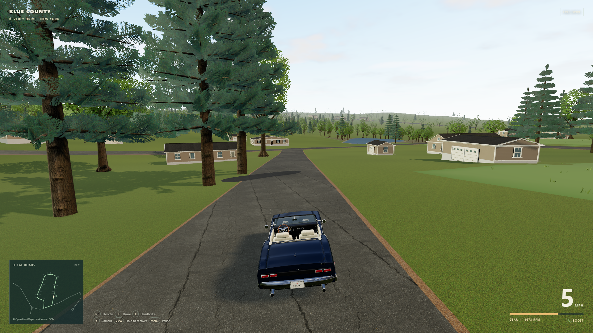
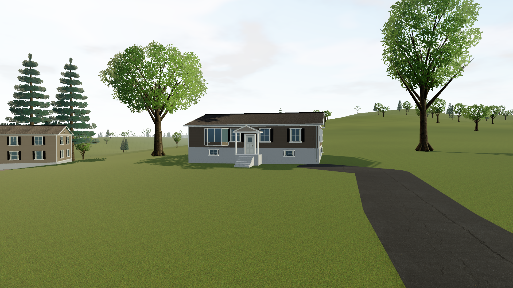

# Beverly Drive reference reconstruction

This document records the initial reconstruction. The subsequent [property pass](property-pass.md) replaces the driveway strips and corrects Home's formerly incomplete approach using older official aerials, with an apron spawn, decks, pools and junction signs. Its per-feature dates and confidence supersede the driveway limitations below.

This pass reworks scenery around the starting **Beverly Drive horseshoe and its connecting West Ridge Road segment**, using public GIS geometry, spring 2025 aerial imagery and six inspected exterior listing photographs. It covers approximately **428 × 630m**, with local bounds X −334 to 94m and Z −389 to 241m relative to 2 Beverly Drive. The broader map and the separate **Ridge & Hollow** race remain available and retain their original route. The active `../oldsmobile_442` Blender source was not changed.

The real neighborhood loop measures **1,218.89m** along the cached OSM centerlines. Beverly Drive way `20686958` joins West Ridge Road way `20668865` at shared nodes `221872780` and `221872784`; the closing segment is an existing road. This is a reference loop for neighborhood driving, not a newly invented connection or a replacement race.

## What changed

| Evidence in the compiled reference area | Interpretation in the game |
|---|---|
| **64 state building footprints**, including accessory buildings | Source outlines replace the previous approximate address-point houses. Rendered envelopes, roof shapes and heights remain simplified. Garages/sheds are partly classified by size, so their exact use is not independently established. |
| **37 driveway approaches** | Visible pavement traces guide asphalt approaches. Original pixels, widths, confidence and occlusion notes remain available. Hidden segments are not treated as fully observed. |
| **122 crown observations** | Observed crown centers and approximate radii guide tree placement. They are not measured trunks; candidates obstructing roads, buildings or driveways are omitted. The count is before these omissions. Woodland interiors use representative procedural stems. |
| **Six photo-observed facades** | Numbers **22, 26, 29, 34, 35 and 41** have limited source-supported colors and visible architectural details. Other facade colors are neutral placeholders. |
| Aerial pavement cross-sections **8.94–9.53m** | Beverly and the inspected West Ridge segment use approximately **9.2m paved width**, with no invented painted center stripe. Geographic OSM centerlines remain unchanged. |
| Observed lawn, woodland and other ground-cover patterns | Terrain-following procedural surfaces suggest their plan shapes. Pond water is level, with approximate banks because the coarse terrain does not resolve pond basins. The aerial photograph is a research reference, not a ground texture. |

The game build writes the reference data to [`public/map/beverly-survey.json`](../public/map/beverly-survey.json), also referenced by the map manifest. The count of 64 buildings comes from clipping a buffered query of 65 footprints to the implemented area; it does not mean 64 separate residences. The current renderer retains **96 observed crown placements**, omits **26 obstructed candidates**, and adds **284 representative woodland stems** within the annotated woodland polygons.

## Inspect the evidence

Open the [interactive source overlay](research-beverly/review-overlay.html) to compare the original aerial with state outlines, parcel address labels, corrected east/west driveway traces, crown observations and the OSM loop. Each layer can be toggled. Clicking the image reports original image pixels, local meters and latitude/longitude. Red driveway traces indicate low confidence; confidence and occlusion notes are retained in the observation JSON files.

The page and its adjacent JPEG can be opened together locally. Alternatively, run `npm run dev -- --port 5174 --strictPort` and open `http://127.0.0.1:5174/docs/research-beverly/review-overlay.html`. The production game itself does not request this page or any live map service.

The source image is **1800 × 2650 pixels**. Its exact returned EPSG:3857 extent is in [`ortho2025-export-georeference.json`](research-beverly/ortho2025-export-georeference.json), with a paired worldfile. Exported ground pixel spacing is about 0.238m, but the service's approximately 12-inch native display resolution limits actual detail. A finer export grid does not create new detail. The underlying municipal source archive identifies six-inch, four-band imagery; the exact individual flight day was not established.

The [exterior observations](research-streetview/exterior-observations.md) link the six ordinary ground-level photographs and describe only visible features. Full Street View coverage was not obtained. This is a targeted evidence-based interpretation, not an exact street-level replica or a survey.

## Confidence and known gaps

- **Home:** the address anchor is 41.283879, −74.3662393. The state outline for the main house and the detached garage/shed align with the corresponding aerial roofs in broad position and orientation. Meter-scale differences can come from roof overhang, orthorectification and older outlines; no global offset was justified. Trees obscure the driveway between its visible road mouth and the house/garage. Only that mouth stub is traced. Home therefore remains a roadside spawn about **24.4m** from the address point, facing the eastern West Ridge exit.
- **Source age:** of the 64 compiled footprints, **61 carry a 2013 source date, two 2021–22, and one no usable date**. The county layer's March 2025 update is not the capture date of every feature. Comparison imagery is spring 2025, so additions, outline differences and overhangs can remain unresolved.
- **Addresses and setbacks:** footprint-to-parcel association uses polygon containment and public site addresses. Accessory structures near differing source boundaries can be misassociated. Parcel boundaries and the resulting road distances are not surveyed setbacks. Owner names and mailing addresses were not requested.
- **Driveways:** visual tracing generally has roughly 1–3m planimetric uncertainty, greater under vegetation. The four pavement cross-sections have approximately 0.8m edge uncertainty. West-side review corrected wrong-side approaches and endpoints passing through roofs; the reviewed source centerlines no longer crossed building polygons at sampled points. This does not guarantee clearance of every full-width pavement edge. The builder retains `surveyPoints` and may extend a mouth to the unchanged OSM road alignment to avoid a rendering gap.
- **Appearance:** listing capture dates are unknown. Color confidence is moderate because lighting and image processing affect the photographs. Unseen sides, window placement, roof dimensions, precise materials, building heights and unobserved paint colors remain approximate. Compact entry landings and steps provide plausible access to raised doorways; their dimensions are not surveyed. Overhead imagery does not establish these details.
- **Vegetation and terrain:** crown observations do not resolve exact trunks, species or heights. Tree omissions preserve driving clearance without pretending to relocate an observed crown. Coarse USGS terrain remains the existing elevation source, so driveway slopes and small grade changes are not recreated precisely.

Beyond the reference bounds, the wider neighborhood retains generic scenery and the documented 10.5–13m game road widths. See [geography.md](geography.md) for the full map, coordinate system and road/terrain alignment.

## Reproduce the reference pass

From the repository root, `npm run map` runs the offline standard-library Python builder. `scripts/map-build.py` applies `scripts/beverly_build.py` to the cached source files, preserving the broader map and producing the neighborhood survey JSON. No account, key or network request is needed for this rebuild.

The human observations are recorded in [`annotate-east.py`](research-beverly/annotate-east.py) and [`annotate-west.py`](research-beverly/annotate-west.py). These scripts convert recorded source-image coordinates into the common local meter system; they do not automatically infer buildings or driveways. After intentionally revising annotations, regenerate the corresponding observation JSON, run `python docs/research-beverly/build-review.py`, inspect the overlay, and run `npm run map`.

[`fetch-references.py`](research-beverly/fetch-references.py) is a separate, explicit network refresh for the bounded NYS reference area. It records service metadata and exact returned image extents. `scripts/map-fetch.py` refreshes the broader OSM/USGS sources instead. A new source snapshot needs visual review before it replaces the inspected one.

## Verification

All **50 tests across seven files** pass, including checks for exact source footprint vertices, connected loop topology, explicit facade evidence, Home's incomplete observed driveway, reference-area vegetation exclusions, bay-window orientation, entrance access and concrete materials. The production TypeScript/Vite build succeeds. The browser race still completes all **777 ordered gates over three laps**, followed by controller-input simulation of restart and Return Home; its latest result is **6:35.58**.

The separate `npm run test:beverly` drives the complete 1.219km neighborhood loop with the actual vehicle physics. It finishes without teleporting and without steps having fewer than two wheels grounded. The run also checks all graphics presets and saves the Home, house and overview screenshots. Its short moving **1920 × 1080 High** sample on a **GTX 1660 SUPER / Edge 153** measured **16.70ms median and 16.80ms 95th-percentile** frame intervals, approximately 60fps. This is a 12-second sample, not a guarantee for every location or machine. The driver is scripted; physical controller feel and latency were not measured. Exact timestamps, hardware, frame counts and any shader warnings are in [`beverly-verification.json`](beverly-verification.json).

## Sources and resource terms

References were inspected/retrieved **2026-09-20**. The game uses cached geometry and original procedural scenery; it does not stream imagery.

| Source | Provenance and limits |
|---|---|
| **NYS ITS Geospatial Services / NYSDOP, spring 2025** | [2025-only imagery service](https://orthos.its.ny.gov/arcgis/rest/services/wms/2025/MapServer), [official Orange County downloads](https://gis.ny.gov/orange-county-orthoimagery-downloads), [2025 program page](https://gis.ny.gov/2025-orthoimagery). The explicit 2025 service was used because a separate latest-imagery index still returned 2021 locally. |
| **NYS ITS Geospatial Services, Orange County GIS Division, NYSERDA and contributing sources** | [NYS building-footprint service](https://gisservices.its.ny.gov/arcgis/rest/services/BuildingFootprints/MapServer). Feature-level source dates are preserved rather than replaced by the layer publication date. |
| **Orange County and NYS ITS Geospatial Services** | [Public tax-parcel service](https://nysgeohub.ny.gov/arcgis/rest/services/Parcels/NYS_Tax_Parcels_Public/FeatureServer). Public 2025 parcel geometry/site-address data, published May 2026, support association only. |
| **OpenStreetMap contributors** | [Copyright and ODbL attribution](https://www.openstreetmap.org/copyright). Road topology and geographic centerlines retain the map's ODbL notice. |
| **Exterior listing photographs** | Individually credited in [exterior-observations.md](research-streetview/exterior-observations.md). Source links and concise factual observations are included; the photographs are not included as game or repository assets. |

The [NYS orthoimagery FAQ](https://gis.ny.gov/orthoimagery-faqs) describes no-cost viewing/download access. [ShareGIS](https://gis.ny.gov/shareGIS/) describes free public web services, exports and custom JavaScript/HTML display. Official ArcGIS item metadata supplies **as-is / no-warranty** notices, cached in `docs/research-beverly/ortho-item.json` and `footprints-official-item.json` with associated metadata. No named Creative Commons license, blanket public-domain declaration or separate express derivative-redistribution license was established for the specific imagery. Do not relabel these independent NYS resources CC0 or substitute a third-party mirror's license. Preserve the source credit, dates and terms when reusing the cache.

The aerial is retained as an attributed research reference and is absent from the game's public texture assets. Listing images have no established open redistribution license and remain with their respective rights holders. No Google imagery is bundled. Existing scanned materials/HDR resources keep their separate CC0 credits in `public/textures/manifest.json`; NYS references and listing photographs do not inherit those licenses.
