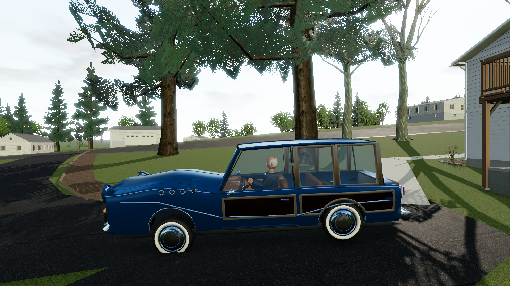
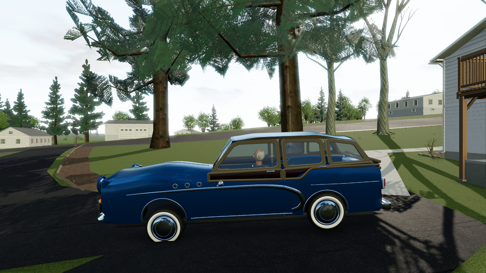
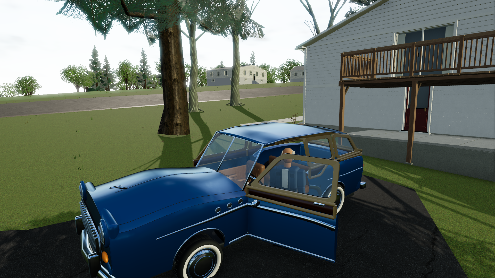

# Ed's Buick wagon — reference correction

The supplied September 22, 2026 photograph shows the wood concentrated in the upper body: honey-colored framing surrounds the windows, and a narrow dark panel sits directly beneath them. The earlier model incorrectly carried large wood panels across the lower doors and rear quarter. Ed retains the blue paint requested by his owner; the photograph guides the body construction.

## Same-camera comparison in the game

Both views use the actual production game at Home, High graphics and 1920×1080, with identical saved camera coordinates.

| Before | Corrected |
| --- | --- |
|  |  |

The Blender rebuild adds continuous warm window framing, a shallow dark infill band, a rounded roof and sloped rear glass. The lower belt rises over the blue rear haunch. Three fender portholes per side and a broad curved chrome sweep follow the visible reference cues. The front window framing, veneer, glass and corresponding chrome move with each opening door; fixed trim no longer bridges the opening. A final in-game inspection caught a slit above the wooden frames: a fitted header now closes that roof joint, and a raycast regression covers it. Capped rail ends and brighter authored wood improve the shaded view at Home.



## Source and reproduction

The editable source remains `asset-source/lug-nuts-cars.blend`. Ed's collection was rebuilt while preserving the other three local car collections and all other cars' exported files. Rebuild just this car with:

```powershell
npm run export-club-cars -- -Member ed
npm test
npm run build
# With the production server running at 127.0.0.1:5180:
npm run test:buick-reference
```

The focused browser script reuses [saved camera fixtures](buick-reference-fixtures.json). Its `--before` mode can initialize a new baseline before a future edit. The delivered Ed GLB has 132,730 triangles and is 3,736,148 bytes. SHA-256:

```text
de6efdeb9baf2da42d12a0e0ff6767f9a91f818c724264a3c36f08d1756eb354
```

The model uses original geometry and generated wood grain. The supplied photo is a visual reference; its pixels are not included in the game or this repository.

## Verification and remaining detail

All **216 tests across 28 files** and the production build pass. Nineteen actual-GLB regressions include both doors, driver clearance, tire geometry and the new wood/paint separation. The [focused browser report](buick-reference-verification.json) checks the HTTP-delivered asset against the source checksum, captures the corrected model and exercises exiting, walking away and back, re-entry, acceleration and braking with normal game input.

This corrects the wood placement and several surrounding proportions. The wagon remains a stylized model: its grille, front sheet metal, hubcaps and cabin still need further modeling to reproduce the reference's finer construction and wire wheels. Hidden details and exact dimensions are not established by the single photograph.
