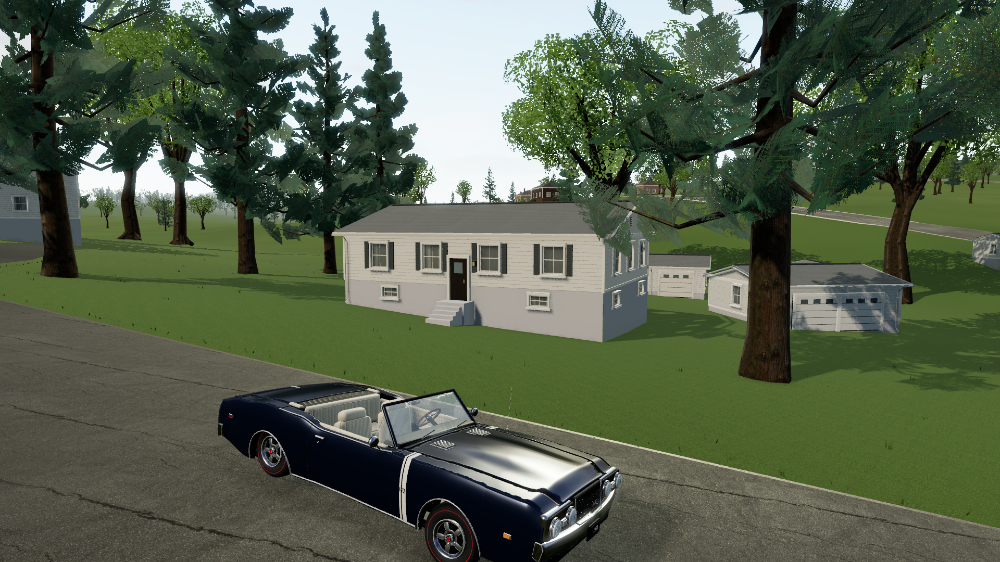
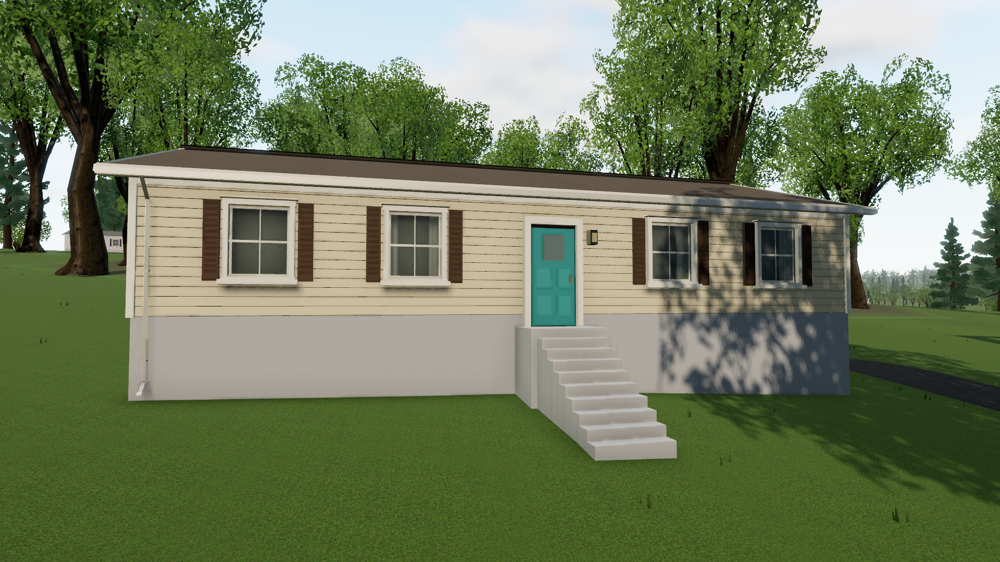

# Beverly detail pass

This pass builds on the reference reconstruction with fuller tree silhouettes, physical facade detail, fine ground cover, and revised daylight. The cached geographic sources, 64 building footprints, 37 driveway approaches and crown observations are unchanged. New construction and surface details are procedural, not additional surveyed evidence.

## Visible changes

- Conifers have irregular curved boughs, bent trunks, drooping and upturned needle sprays. Deciduous crowns have overlapping lobes, interior foliage and varied proportions. Measured crown centers and radii remain exact at both detail levels. Close tree geometry increases about 18% on average; distant templates use about 21% fewer triangles. Draw batches are unchanged.
- Reference houses have real window openings through the facade, recessed reflective glazing, dark cavities and curtain variations. Siding uses 18cm physical courses; roofs have shingle edges, gutters have channels, and downspouts connect to walls. Neutral materials preserve the existing photo-derived paint colors. These details do not establish unseen real-world architecture.
- Fine grass, small irregular soil fragments, aggregate, leaf litter and root contact detail break up the verge. All geometry clears source road, driveway, building and pond outlines. The pass adds 141,538 triangles across the entire reference area, divided into spatial batches with distance and quality reductions. The actual-map audit checked all 424,614 vertices for finite coordinates, clearance and terrain support.
- Lawn and asphalt use aligned stochastic color, normal and roughness sampling to reduce texture repetition. Gravel is more neutral. Daylight, sky and reflections are balanced together. High adds stable 4096px shadows, filtered contact shading and restrained HDR highlight bloom. Contact shading uses the actual rendered depth, including leaf cutouts, and a depth-aware filter removes the previous streaking on walls and steps. Tone mapping runs once.

[Open the interactive before/after comparison](detail-comparison.html). The comparison uses the same inspection cameras; baseline images remain from the prior reference pass. Home's paint color is still provisional.

## Verification

`npm test` passes **52 tests across eight files**. New regressions raycast actual window apertures and verify that varied tree shapes preserve each measured crown's radius at both detail levels. The production build passes.

`npm run test:detail` passed the complete neighborhood drive using actual vehicle physics, all three graphics presets, Low → High resizing, and handling-grounds → Home environment disposal/recreation. There were no JavaScript, WebGL or failed-resource errors. Six reference views are saved with the report.

Measured on September 20, 2026 in Edge 153.0.4234.48, Windows, GTX 1660 SUPER / ANGLE D3D11. Each moving sample starts independently at Home and records 12 seconds of animation-frame timestamps after acceleration. CSS viewport is 1920×1080; Low renders at 1440×810.

| Preset | Median | 95th percentile | Mean | Last draws | Last triangles incl. shadows |
|---|---:|---:|---:|---:|---:|
| High | 16.70ms | 16.80ms | 16.68ms | 620 | 3,787,063 |
| Medium | 16.70ms | 16.80ms | 16.68ms | 535 | 3,282,098 |
| Low | 16.70ms | 16.80ms | 16.68ms | 387 | 1,944,573 |

The measured output is approximately 60fps in the final run. A blank-page sample in the same browser immediately before game load also measured 16.70ms median / 16.80ms 95th-percentile compositor cadence; this does not measure spare GPU capacity. The final shader run retains only the existing driver constant-rounding warning. Exact timestamps, baseline and transition results are in [beverly-detail-verification.json](beverly-detail-verification.json). These short samples are not a guarantee for every location, machine or thermal condition. Physical controller feel and latency remain outside automated verification.

The full synthetic-controller browser flow also passes: all 777 ordered gates over three laps, results at 6:35.58, controller-only restart and Return Home. See [browser-verification.json](browser-verification.json).
