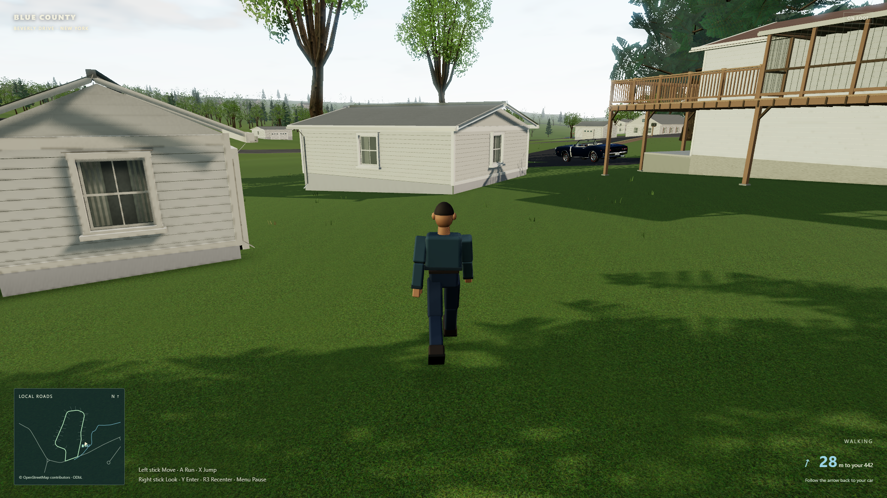
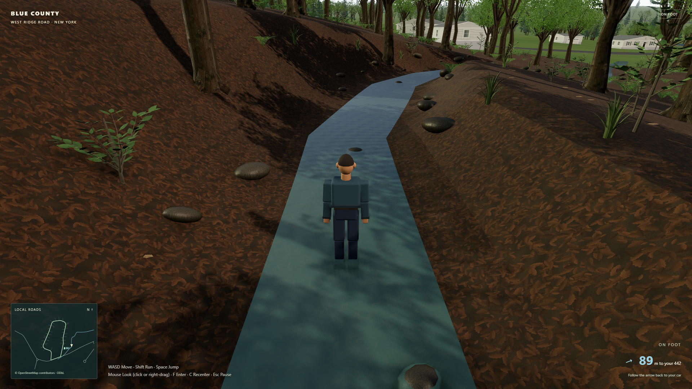

# Driver and on-foot exploration

This pass adds a replaceable driver visual and the ability to leave the Oldsmobile, explore the neighborhood on foot, and return to the car. Character presentation is separate from movement and collision so a future Blender model can replace the placeholder without rebuilding the controls.

## Controls

| Action | Keyboard / mouse | Standard Xbox controller |
| --- | --- | --- |
| Enter / exit the car | F | Y |
| Move on foot | WASD / arrow keys | Left stick |
| Sprint | Hold Shift | Hold A |
| Jump | Space | X |
| Look around | Click for mouse capture, or right-drag | Right stick |
| Change driving camera | C | Press right stick (R3) |
| Recenter foot camera | C | Press right stick (R3) |
| Pause | Escape / P | Menu |

Analog movement retains partial-stick walking speed, and diagonals are normalized. Jump and interaction require a fresh press; holding the interaction button through a transition cannot immediately reverse it. Mode changes and safety pauses require controls to be released before play resumes. Keyboard and controller inputs remain available in menus.

Leaving the car requires a stopped, upright car with a clear grounded exit. Re-enter from a nearby door with a clear line of sight. The car stays parked while exploring. The Ridge race keeps the player in the car; free drive and the handling grounds support exploration. Escape releases mouse capture and pauses.

## Integration

The placeholder uses meters, +Y up, +Z forward, and a feet-level origin. `CharacterVisual` owns its presentation and pose updates; gameplay owns its world position and collision. The seated pose is calibrated to the imported Oldsmobile's US driver seat and steering wheel. A replacement should implement the same root, animation update and disposal contract.

Existing input settings and device-specific mappings are migrated in place. Standard-controller Y now enters/exits the car, and R3 changes the driving camera. Unknown controller layouts require the added foot controls to be mapped rather than guessing axis or button assignments. See [controller.md](controller.md) for calibration, input safety and physical-controller checks.

## Verification

Both browser passes ran in fresh Edge 153 contexts on 2026-09-21. The [first pass report](exploration-first-verification.json) records 11 completed checks. After reviewing that result and making a further polish pass, the [independent second pass](exploration-second-verification.json) repeated the full player journey and completed 19 checks on production bundle `index-C_G7uHGD.js`. All 10 final screenshots were visually inspected. Both runs reported zero JavaScript, resource or WebGL errors; the existing nonfatal ANGLE X4122 shader precision warning was retained in the reports.

The starting flow uses actual browser keyboard and mouse events: select Drive from Home, press F to leave, walk, hold Space for one jump, return to the car, enter, and accelerate. The checks verify that holding F/Y does not reverse the transition, the parked car stays put, unsafe moving exits are rejected, and the nearby door offers a readable entry prompt. Right-drag and pointer-locked look both work; Escape releases capture and pauses. The first review caught a real pointer-event mismatch in right-drag handling, which was corrected and retested with actual pointer events.

Fixed-step checks use the same pedestrian controller and Rapier world as play. They include the house wall, photographed front tree, parked chassis, map boundary and continuous walking through 12 mapped creek stations. Ground travel across the actual triangle mesh compares forward and diagonal travel within a 3% solver tolerance; input-vector normalization is tested exactly in the unit suite. In the final two-second samples, walking covered 4.82 m, sprinting 11.11 m and diagonal walking 4.76 m. A held jump reached a 0.97 m apex and landed without automatically repeating.

The second pass also verifies every character joint freezes while paused; controller disconnect requires deliberate resume; low, medium and high quality preserve the active character; repeated entry and neighborhood/handling-ground reconstruction do not duplicate the driver; and starting a race restores the seated driver. AI traffic yielded for 10 simulated seconds, keeping at least 8.26 m from the explorer, without incrementing its recovery/life counter or teleporting. The foot HUD remains visible and inside a 1280×720 viewport with 12 px control text.

The moving performance sample ran at High quality, 1920×1080, on an NVIDIA GTX 1660 SUPER after 2.2 seconds of warmup. It measured 12.011 seconds and 29.94 m of continuous actual walking with camera orbit: median frame interval 18.0 ms, p95 18.1 ms, maximum 18.5 ms across 674 intervals, roughly 55 fps in this sample. Foot exploration uses distant tree prototypes beyond 150 m and tighter nearby shadows while preserving the full nearby woods. These measurements describe this machine and scene; they are not a universal frame-rate guarantee.

The final unit suite passed 118 tests across 18 files. The existing [controller and racing browser check](browser-verification.json) also passed the complete three-lap race with all 777 ordered gates, a 6:35.60 finish, controller restart and Return Home, with zero errors. Synthetic Gamepad API tests verify software behavior; a physical controller or felt rumble was not part of this review.

Run the focused checks with:

```sh
node scripts/exploration-check.mjs
node scripts/exploration-check.mjs --second-pass
```

## Final views

The final [driver-seat inspection](exploration-second-driver-seat-detail.png) shows the placeholder on the correct US side. The [front-yard view](exploration-second-front-yard.png), [creek exploration](exploration-second-creek-exploration.png), [walking pose](exploration-second-walking-orbit.png), [running pose](exploration-second-running-to-woods.png) and [1280×720 HUD](exploration-second-narrow-hud.png) show the actual rendered scene and character.





## Current scope

The driver is a simple articulated placeholder intended for replacement with a Blender character. The car's existing asset has no separately hinged doors, so entry and exit use a short character/camera transition without opening a modeled door. Exploration covers the neighborhood exteriors and handling grounds, including the shallow creek bed; it does not add building interiors or swimming. The player returns to their own Oldsmobile, and the Ridge race remains a driving event.
