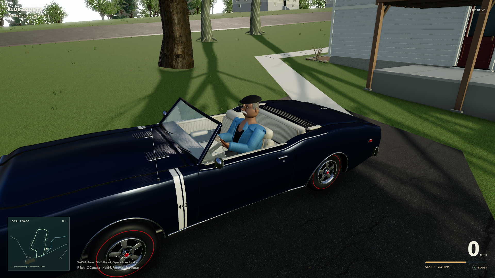
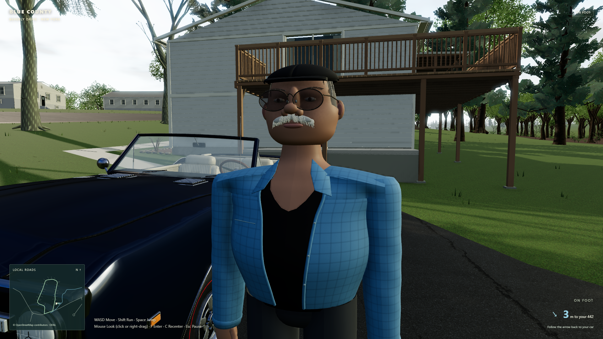
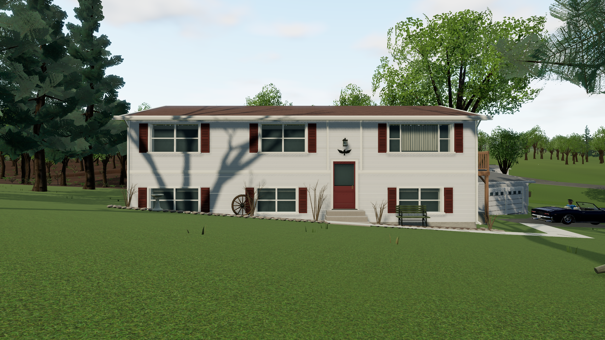

# Blender character, interactive 442 and Home props

This pass replaces the temporary driver with an original Blender character based on the supplied photograph, gives the existing 442 real opening doors, and replaces four Home yard ornaments with detailed Blender assets. The mapped house, driveway, deck, yard and stream layout keep their existing reference-based placement.

## Dad with a coppola

The character is a stylized interpretation of Dad: a full rounded face, prominent nose, silver-white mustache, thin rounded tinted glasses, salt-and-pepper side hair and a low charcoal Italian coppola. He wears a light blue checked overshirt over a charcoal V-neck, dark trousers and shoes. The face and clothing are modeled geometry with original materials and generated fabric textures. The reference photograph is not copied into a texture or embedded in the Blender file or GLB.

The likeness comes from one photograph. Side and back views, hidden proportions and clothing details are inferred; this is not a photogrammetry scan or a claim of exact likeness from every angle. Fingers are modeled, but the rig does not have separate finger-animation bones or a facial-performance system.

The editable [dad-driver.blend](../asset-source/dad-driver.blend) contains the model, packed original fabric textures, 15-bone armature, animation actions and a reusable portrait studio. The game loads [dad-driver.glb](../public/assets/dad-driver.glb); its [manifest](../public/assets/dad-driver-manifest.json) records axes, feet-level origin, seat anchor, bones and clips. The source uses meters and exports with +Y up and +Z forward. The final model is 1.784 m tall with 75,300 triangles and 21 materials, occupying 3.83 MB.

The final review corrected an invalid fabric export that treated color images as tangent-space normal maps, making the cap and shirt too dark. The GLB now retains valid fabric color maps; procedural bump shading stays in Blender until it is properly baked for the game. A regression check guards against the same export mistake.

Idle, Walk, Run, Airborne and Seated are Blender-authored in-place clips. `src/dad-character.ts` clones the skeleton for each runtime instance, blends the clips and adjusts their speed to actual movement. A two-arm inverse-kinematics pass places the driving hands near the steering rim; supporting-foot correction keeps the visible shoes on the movement surface. Gameplay continues to own position, collision and input. The seated driver remains on the correct US-left side of the car.





[Blender portrait of the editable character](dad-driver-blender-portrait.png).

## Opening the actual 442 doors

The car retains the supplied body, interior and wheels. Its original continuous body sides, cabin shoulders and belt trim are cut along the authored door seams so that each opening is real. The door card, armrest, handles, window crank, mirror and triangular vent window move with the door. Painted metal returns, inner pressings, jambs, seals and sill scuff plates finish the exposed surfaces; the windshield, A-pillars and rockers remain fixed.

The editable derived source is [oldsmobile-442.game.blend](../asset-source/oldsmobile-442.game.blend). Both this file and the exported [oldsmobile-442.glb](../public/assets/oldsmobile-442.glb) contain `DoorHinge_L/R` and `DoorMesh_L/R`. The [vehicle manifest](../public/assets/vehicle-manifest.json) records the hinge pivots, local axis, outward rotation signs and 68-degree opening limit. `src/vehicle-doors.ts` supplies independent door progress and a close/reset operation without changing chassis or suspension physics.

Getting in and out uses a 1.65-second blended transfer: the selected door opens, the character blends between the authored seated pose and the outside position, then the door closes. This is a procedural transition using the Blender rig, not motion capture or a bespoke hand-to-handle performance. Entry and exit still require the existing safe positioning and clearance checks.

The adjacent active car source and [1968_oldsmobile_442.snapshot.blend](../asset-source/1968_oldsmobile_442.snapshot.blend) remain read-only. The door exporter preserves the original closed bounds, US-left steering layout and wheel pivots. See [the vehicle contract and open-door views](vehicle.md) for details.

The controller follow-up separates the original rim, spokes, hub and horn details into a `SteeringWheel` pivot. The manifest records its center, radius and tilted axis toward the driver. `src/steering-wheel.ts` drives the actual wheel and both wrist targets with the same rotation: steering right turns it clockwise from the seat, with the left hand rising and the right hand falling. The column and turn-signal stalk stay fixed. The character's authored Blender clips are unchanged; the runtime arm solver follows the moving rim.

## Four Home props at their existing anchors

[beverly-home-props.blend](../asset-source/beverly-home-props.blend) contains an editable bench, wagon wheel, birdbath and number 2 mailbox. The [exported kit](../public/assets/beverly-home-props.glb) replaces the corresponding earlier props at the same house-local placements. It adds shaped joinery, slats, rims, fasteners, mailbox construction, flag and material wear while preserving their role in the supplied Home views.

Original generated wood-grain and mineral textures are packed into the Blender file and embedded in the GLB. No street photograph pixels are used. Fine construction details, wear and the birdbath bowl profile are representative modeling choices where the photographs do not resolve them. The [kit manifest](../public/assets/beverly-home-props-manifest.json) records the four nodes, pivots, geometry counts and provenance. Runtime ownership in `src/home-props.ts` keeps scene-rebuild disposal separate from the cached source kit.



## Rebuild the assets

Run from the game directory with Blender 5.2 installed at the configured Windows path:

```powershell
npm run export-driver
npm run export-home-props
npm run export-car
```

`export-driver` runs [build-dad-driver.py](../scripts/build-dad-driver.py), and `export-home-props` runs [build-home-props.py](../scripts/build-home-props.py), through `scripts/build-hero-assets.ps1`. `export-car` runs [export-car.py](../scripts/export-car.py) through `scripts/export-car.ps1`. The generators recreate their derived Blender and GLB outputs; manual Blender edits should be preserved before regenerating. The car exporter reads the saved snapshot and writes the separate game source.

## Validation

The focused door checks load the delivered GLB and cover the closed silhouette, both real hinge pivots, unchanged fixed body, outward door movement and actual doorway clearance. The closed car, both open sides, doorway and interior-card Blender renders were visually inspected.

The final unit suite passed 127 tests across 20 files. Production build `D24crcii` was exercised by the [hero asset review](hero-verification.json) and the [19-check second exploration pass](exploration-second-verification.json) in Edge 153 on September 21, 2026. Both browser reports contain zero JavaScript, resource or WebGL errors. The exploration pass covers actual keyboard entry/exit, mouse capture and release, walking/jumping, collision and creek support, pause/focus behavior, controller disconnect safety, all three graphics settings and repeated scene recreation. The refreshed seated, standing, walking, running, creek and 1280x720 HUD screenshots were visually reviewed.

The traffic test places the explorer ahead in the car's lane using the road tangent, rather than extrapolating toward a nearby centerline checkpoint. Over ten simulated seconds, traffic retained its life counter, left at least 8.29 m of center-to-center clearance, and remained below 0.082 m/s throughout the final two seconds. The stopping, clearance and no-teleport assertions remain in place.

At High quality and 1920x1080, a 12.014-second moving sample covered 29.94 m with camera orbit after warmup. Across 675 measured frame intervals, the median was 17.9 ms, p95 18.1 ms and maximum 18.3 ms, about 56 fps in this scene on this desktop. This is a measured sample, not a universal frame-rate guarantee. Controller automation uses synthetic Gamepad API input; physical controller feel, end-to-end latency and felt rumble remain unverified.
