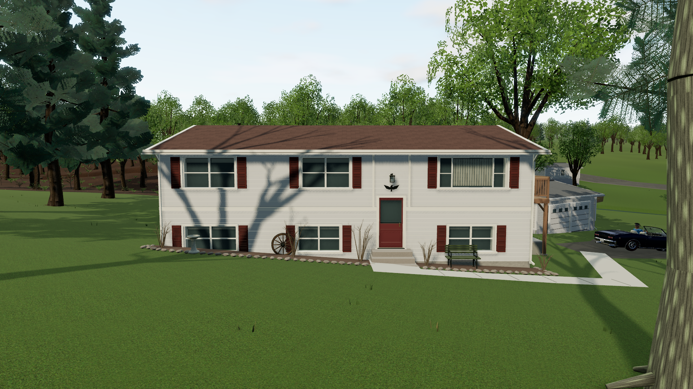
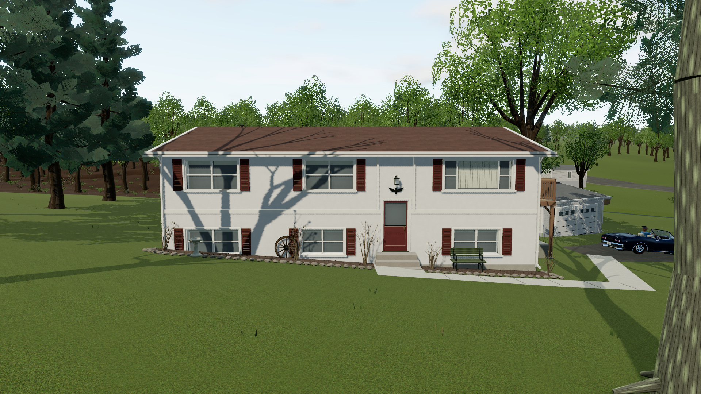
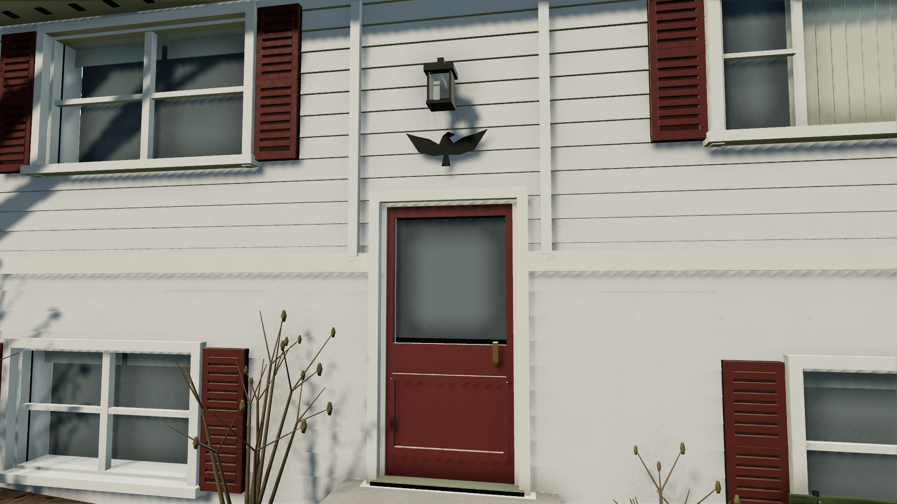
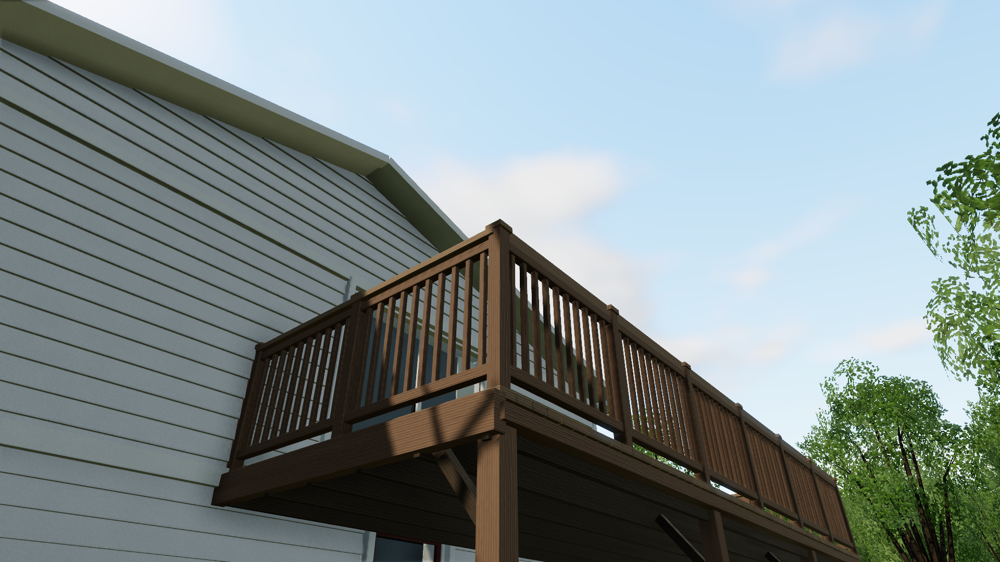
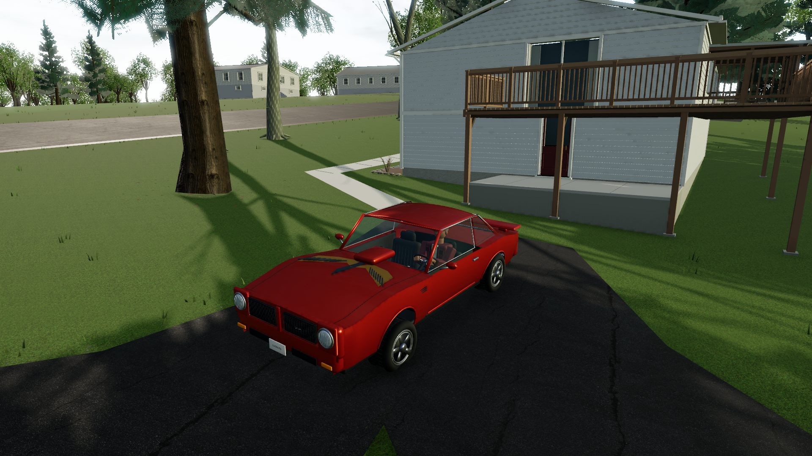
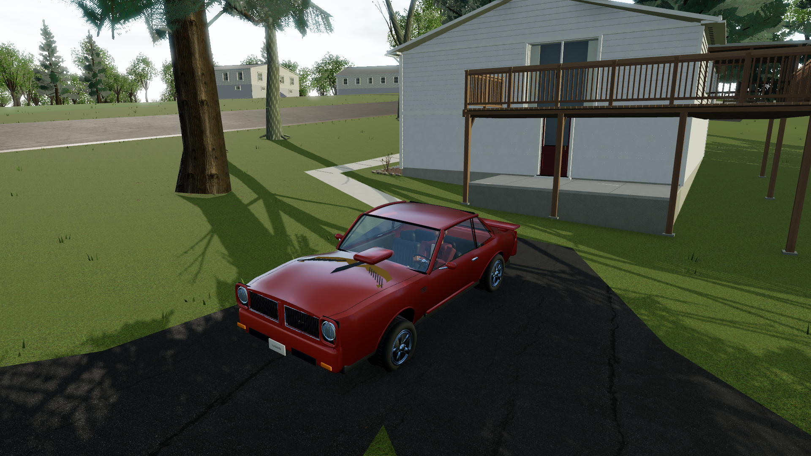
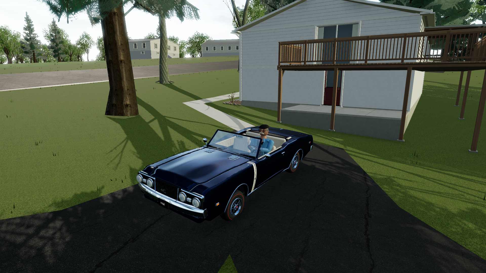
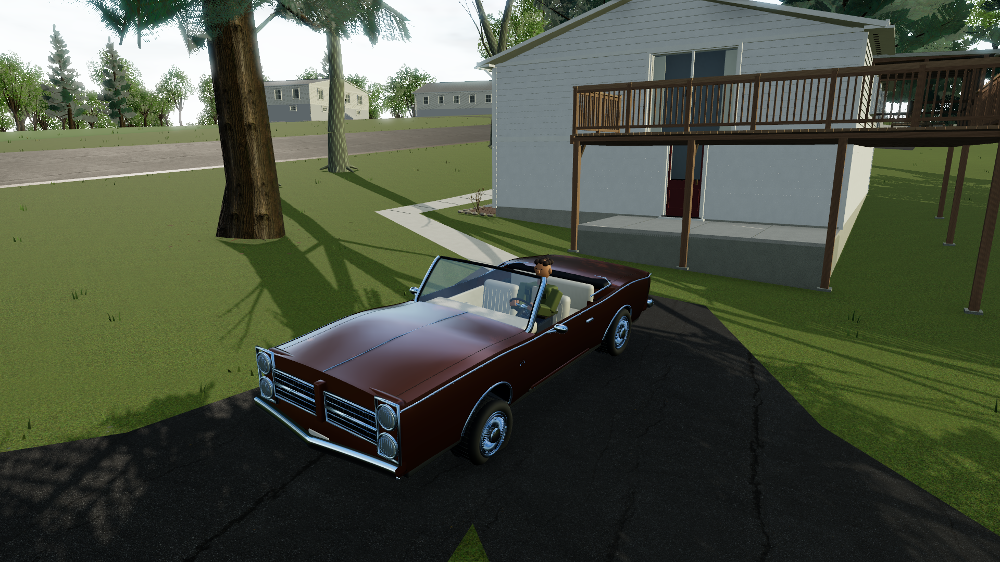

# 2 Beverly and the Lug Nuts — visual pass

September 22, 2026 · branch `codex/beverly-car-visuals`

This pass improves the surfaces, bodywork and lighting that are visible while driving or walking around Home. Screenshots below come directly from the playable production build. The before/after pairs use the same world-space cameras, parked-car transforms and resolution; animated foliage/cloud phase is not frozen.

## 2 Beverly Drive

The house now uses tapered clapboards, physically scaled paint grain, separate normal/roughness maps, closed window reveals and angled blinds. Roof caps, drip edges, soffit vents and downspout straps finish the roofline; the gable overhangs now have closed undersides when viewed from below. The mapped footprint, red entrance, window arrangement and driveway-side deck/patio relationship retain their reference placement.

| Before | Current |
| --- | --- |
|  |  |

Deck boards and rails have directional grain. Concrete has pore detail; mulch, bed edges, shrub buds and mature-tree bark add variation around the existing yard. These are original generated materials, not pixels copied from the street photographs. Board detail receives the house's shadows while the structural walls cast its silhouette, avoiding subpixel shadow casting from individual siding courses.

## Cars

The four club cars were refined in Blender and re-exported with their opening doors, seating, steering and wheel pivots intact. Continuous curved panels replace disconnected strips; compound glass, formed pillars, wheel housings, deeper lamps/grilles, stitched upholstery and instrument details improve close views. Wheel treatments now distinguish the Pontiac, Camaro, Trans Am and Buick. Exact trim, proportions and wheel specifications remain interpretations where reference views are insufficient.

| Lou before | Lou now |
| --- | --- |
|  |  |

Joe retains his existing detailed 442 geometry. All five cars now have independently owned runtime materials: layered clearcoat paint, dielectric glass, rubber, upholstery and trim. Solid paints use a less metallic base than sapphire/bronze/graphite. An HDR reflection capture of the actual Home surroundings is generated once during loading, excluding cars and actors; it includes the authored sky/clouds. Medium/High use it near Home, with the existing outdoor HDR elsewhere. No cube cameras run every gameplay frame.

## Rendering and validation

Home uses a tighter High-quality shadow region, balanced daylight and a smaller shadow-filter radius. The High contact-shading pass now reconstructs surface normals from nearby depths on the same face and ignores very small relief; this removes the broad dark streaks that tiny siding joints previously produced. Car reflection intensity was reduced after actual screenshot comparisons showed the early settings bleaching the paint colors.

The production build and **214 tests across 28 files** pass. Seventeen tests inspect the delivered car geometry, including real open-door clearance, tires, roof/head clearance and steering grips. Surface tests cover map color spaces, scale/orientation and material ownership; the Home tests retain the observed opening layout and verify the closed soffits.

The [visual report](hero-visual-verification.json) records twelve game captures, five-car surface checks, all quality presets, resize and independent moving frame samples. The [club gameplay report](hero-visual-club-verification.json) exercises all five selections, actual driving, walking away and returning, entry/exit, persistence and loading cancellation. Both use system Edge. Controller input in automation is synthetic; physical controller feel and rumble are not established by these checks.

| Moving sample on this desktop | Median frame | 95th percentile |
| --- | --- | --- |
| Before · Medium · 1280×720 | 18.0ms | 18.1ms |
| Current · Medium · 1280×720 | 17.9ms | 18.1ms |
| Current · High · 1920×1080 | 18.0ms | 18.1ms |

These are ten-second local measurements on the GTX 1660 SUPER in Edge 153; High has no corresponding baseline. The small Medium difference is not a meaningful speedup claim. No runtime/resource/WebGL errors were recorded; an existing nonfatal ANGLE numeric-precision warning remains in the report.

Replay the current views with `npm run test:hero-visual` while the production server runs on port 5180. The script uses saved [camera fixtures](hero-visual-fixtures.json). For a new iteration, capture a fresh baseline with `node scripts/hero-visual-pass.mjs --before`, make/build changes, then run the after mode. Raw captures stay in ignored `output/playwright/hero-visual-pass/`.

## Remaining visual limits

This remains a stylized browser game, with substantial distance to a finished AAA environment. The club models still need vehicle-specific hand modeling and richer baked texture detail; the friends use provisional characters. Foliage cards can shimmer, neighboring properties are less detailed, and house interiors are shallow window treatments. The Home reflection is static and approximate, with no moving-car reflections, full global illumination or ray tracing. A short local frame sample is not a universal performance guarantee.
