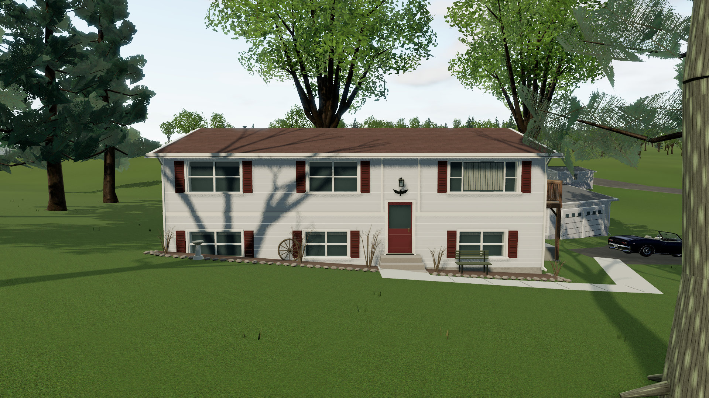
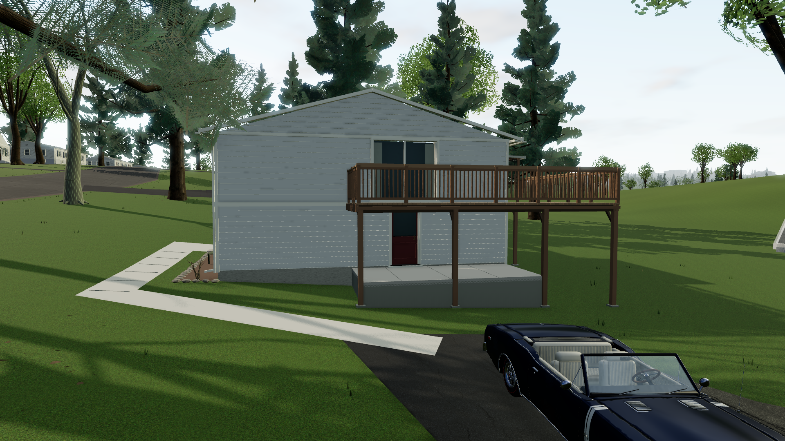
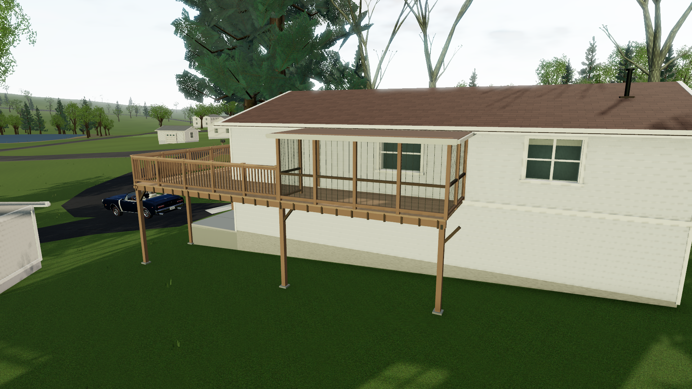

# Home facade and yard detail pass

Home now uses a dedicated reconstruction of the starting house at **2 Beverly Drive**, based on the three street screenshots supplied by the user and the user's description of its side and rear. The front of the house and the open yard are the focus of this pass. The retained NYS footprint and the previously corrected driveway still place the house and parking apron; the new renderer changes their visible detail rather than relocating them.



## Visible reference details

The supplied front views show a long raised ranch with pale horizontal siding, a low brown shingle gable roof, light fascia and a narrow metal roof flue. The front has distinct paired upper windows on the left and near the middle, a wider picture-window group on the right, burgundy shutters, and smaller lower-level windows. The red entrance sits right of center and has a glazed upper portion, pale trim, a short stoop, a small dark lamp and a spread-wing ornament above it. These proportions and details replace the generic Home facade. Paint shades and opening measurements are visual estimates.

The lawn remains broadly open. Narrow mulch beds sit against the foundation with individually spaced, sparse shrubs. The small bench sits beneath the right window; a decorative wheel rests left of the entry; a pale pedestal/birdbath sits farther left. A light concrete walk reaches the steps and turns toward the driveway. At its mouth, a rounded dark mailbox has a red flag, a weathered wood post and the numeral **2**. Timber edging and leaf mulch follow the house side of the driveway entrance.

Three mature front-lawn deciduous trees have exposed gray trunks, high branching crowns, subtle bark and lichen detail, and sparse early-season buds. They keep the facade visible below the crowns. Their positions are perspective-based estimates; they are not survey points or proof of a current tree inventory. The supplied photographs have no established capture date. The driveway-side evergreen screen remains part of the surrounding landscape.

## Side deck, patio and screened rear area

The user explicitly confirms the relationships that the street photographs partly conceal: the deck is on the **right when looking from the road**, beside the driveway; a patio lies beneath it; a red lower door opens onto that patio; sliding doors directly above open onto the deck; and the deck wraps around the back into a roofed screened area.

The reconstruction follows that arrangement with individual wood boards, joists, posts, rails, a lower patio slab, a connected rear deck and a framed screen room. The hidden roof pitch, screen-panel layout, precise dimensions and fine construction details are representative. A rear stair layout remains unverified. This replaces the generic rendering of Home's earlier partial aerial deck observation: the neighborhood retains **11 generic decks plus the custom Home deck**. The Home patio is additional to the three prior observed patios.





## Geography and rendering limits

Home retains NYS building ID `nys-7159466` and its source polygon. Its curved driveway, pavement outlines, road connection and parking-apron start are unchanged from the [property pass](property-pass.md). That approach is supported by the official 2010/2013 aerials and exposed 2025 apron; present-day edges hidden by canopy remain inferred.

Facade and deck heights, garden grades and exact tree coordinates cannot be measured from these screenshots. The approximately 30-meter DEM does not resolve the actual patio pad or garden slopes. Walks and mulch surfaces follow its exact terrain facets; a level patio uses a supporting skirt, and the elevated deck uses posts. These are practical terrain approximations rather than claims about real retaining-wall dimensions. Reference colors also depend on image lighting and white balance.

The original screenshots are **not included in this repository** and are not projected onto geometry or used as game textures. [Home photo observations](research-streetview/home-photo-observations.md) record the visible facts, supplied descriptions and attachment basenames. The rendered game views in this document are original game screenshots. There are now nine houses with facade-photo references: 2, 12, 20, 22, 26, 29, 34, 35 and 41 Beverly.

## Verify and review

```powershell
npm test
npm run build
# With the production server running on 5180:
$env:GAME_URL='http://127.0.0.1:5180'
npm run test:home
```

The Home browser check inspects front, driveway-side and rear views, the facade and property relationships, the starting car, and the custom geometry metadata. The chase camera retracts in front of the elevated side deck and screened enclosure, keeping the starting car visible; these camera volumes do not alter driving physics. Use [home-verification.json](home-verification.json) for the recorded results, browser version, screenshots, rendering messages and measurements from the latest run. The broader [verification notes](verification.md) and [property verification](property-verification.json) document the neighborhood checks.
