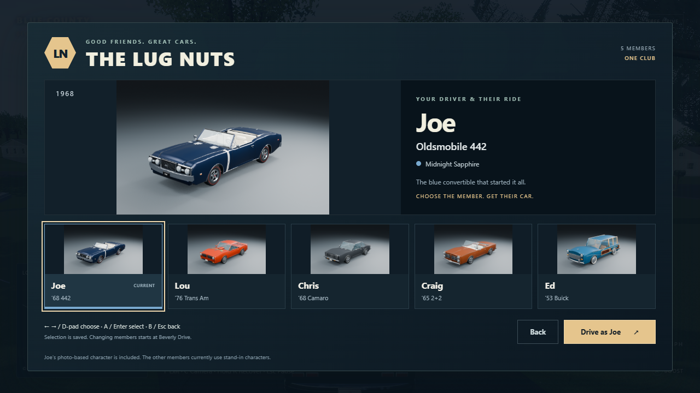
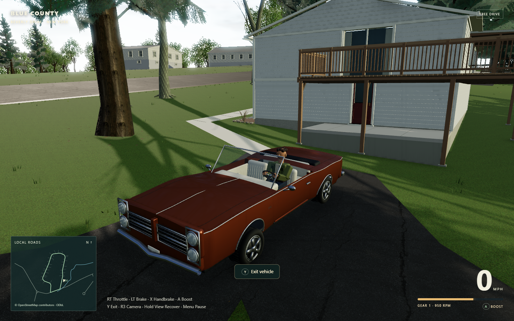

# The Lug Nuts

Choose a driver from the main menu or pause menu; their associated car becomes the player vehicle. Changing members starts a fresh Free Drive at Home. The browser remembers the last successfully loaded choice. Browsing or backing out leaves the current session intact, including when a lazy asset load is canceled.

## Cars and references

| Driver | Car | Reference and current interpretation |
| --- | --- | --- |
| Joe | 1968 Oldsmobile 442 convertible | Existing detailed Blender vehicle and photo-based Dad with coppola are retained. |
| Lou | Carousel Red 1976 Trans Am | User's supplied exterior photo: red-orange paint, black split grille, single round lamps, shaker scoop, stylized gold/dark hood bird, black cabin and alloy wheels. |
| Chris | 1968 Camaro RS/SS | Owner's description. RS concealed-headlamp grille, SS marks and coupe body. Graphite paint is explicitly temporary; no photograph/color reference has been supplied. |
| Craig | Samoan Bronze 1965 Pontiac 2+2 convertible | User's supplied exterior photo: bronze finish, vertically stacked round headlamps, split grille, chrome trim and white open cabin. |
| Ed | Blue 1953 Buick woody wagon | Owner's blue paint specification and supplied wagon photograph: honey-colored window framing, a narrow dark upper panel, painted lower doors/fenders, rounded greenhouse, raised rear haunch, three portholes per side and curved chrome sweep. |

The four cars now have continuous curved body panels, compound windshields, formed roof pillars, recessed front details and distinct wheel treatments. The visual pass also adds layered runtime paint, trim and glazing to all five cars; see the [actual game screenshots](hero-visual-pass.md) and [Buick reference correction](buick-reference-pass.md). New models range from 98k–133k triangles, with editable Blender source and opening-door/seat contracts preserved. Joe's original vehicle geometry is unchanged.

These remain original stylized approximations, not scans or concours-accurate models. Their model-specific proportions, period trim and cabin details need further hand modeling for a hero-quality close-up. Craig's eight-lug wheels and Chris's Rally wheels are period interpretations; the supplied evidence does not establish their exact current wheels. Shared arcade seat proportions keep the driver aligned with the wheel. Only Joe has a referenced human likeness; the friends use distinct neutral stand-ins, with colors/hair chosen for visual identification rather than as claims about their appearance. No supplied photo pixels or real registration plates are distributed as game textures.

Craig's photo-referenced convertible at Home in the actual game. The final manifests also record the [GM Camaro vehicle information kit](https://www.gm.com/content/dam/company/no_search/heritage-archive-docs/vehicle-information-kits/chevrolet/1968-Chevrolet-Camaro.pdf) and [Buick Heritage Alliance 1953 archive](https://www.buickheritagealliance.org/index.php/archives/browse/1953) as period references for the other two new cars.

## Editable assets

- `asset-source/lug-nuts-cars.blend`: the four new cars in separate named collections; editable meshes and materials.
- `scripts/build-club-cars.py`: original geometry, materials, GLB export, manifests and matching studio renders. `npm run export-club-cars` runs Blender in the background. `npm run export-club-cars -- -Member ed` rebuilds only Ed and preserves the other saved car collections and their exported files. Regeneration overwrites the selected generated source, so preserve any manual Blender edits to that car first.
- `public/assets/club-cars/{lou,chris,craig,ed}.glb`: playable models; each companion manifest records geometry, pivots, bounds and limitations.
- `public/assets/club-cars/{joe,lou,chris,craig,ed}-preview.png`: Blender renders of the same game car assets.
- `src/club-roster.ts`: owner/car mapping, presentation and persistence key. `src/club-character.ts` is the replacement point for future photo-based buddy characters.

Joe's source model is imported read-only for its preview. The active sibling `oldsmobile_442` source is unchanged.

## Runtime contract

Assets use meters, +Y up, +Z forward and +X toward the US-left driver side. Each has real `DoorHinge_L/R` front-door meshes, a tilted `SteeringWheel`, and independently named `WheelSteer_*`/`WheelSpin_*` groups. Door cards and outer skins move together. Coupes use lower seat anchors and remain seated longer while passing beneath the roof during transfer.

Each `Vehicle` owns an immutable copy of its wheel positions, radii and chassis bounds. Selecting a longer wagon or convertible therefore cannot alter AI/traffic suspension. Skid contact points use the same individual geometry. Model loading is cached per member; errors evict the failed request for retry. Assets and interactive parts are validated before replacing the playable scene.

## Verification

`npm test` covers asset loading/retry, saved selection, provisional character articulation, hand placement and isolated vehicle geometry, alongside the existing driving and walking regressions. `npm run test:club` exercises the built game with actual rendered frames and synthetic Gamepad API input; generated evidence is stored under ignored `output/playwright/lug-nuts/`. Selected screenshots and the final report are copied here for review. Physical controller feel and rumble are not established by synthetic input tests.

The current unit suite passes **218 tests in 28 files**, including 19 actual-GLB checks that cast rays through opened doorways, measure the exported tire geometry, test the driver's head against the real roof and verify Ed's upper wood/paint separation and moving window frames. Two newer gait checks cover opposing arm/thigh motion and planted-foot stability. See [the rendered walking review](walking-facing-verification.json), [the Buick browser report](buick-reference-verification.json), [the preceding five-car report](hero-visual-club-verification.json) and [the project verification history](verification.md). The [original garage report](lug-nuts-verification.json) is retained as historical evidence.
