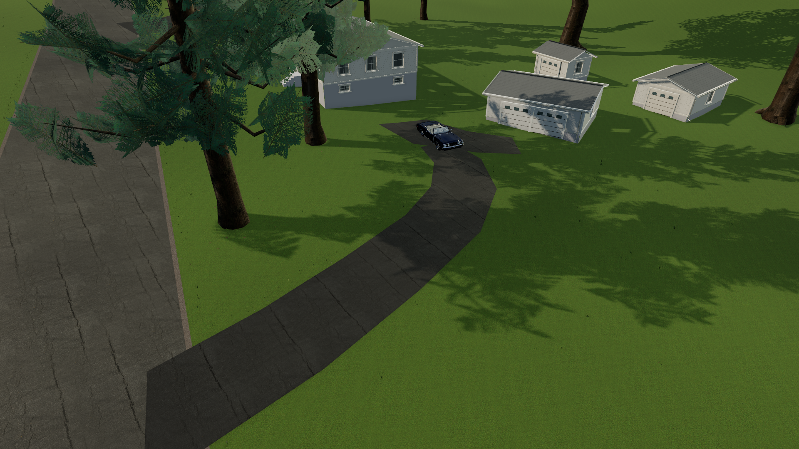
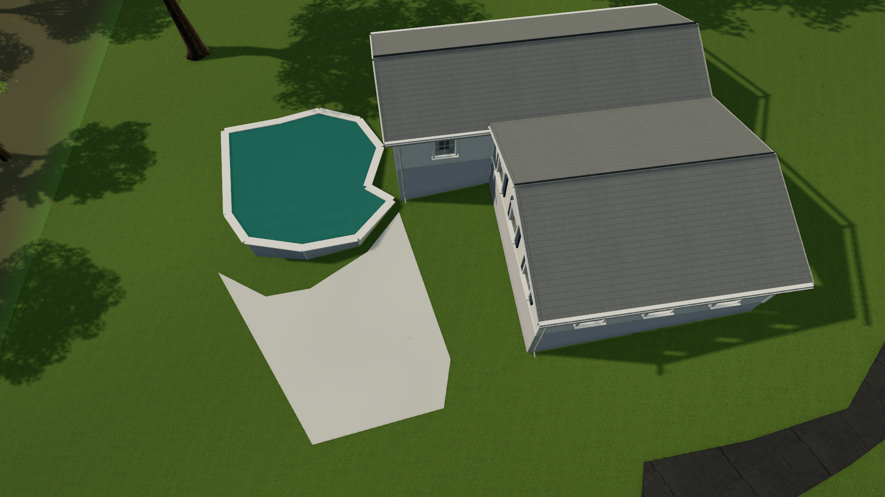
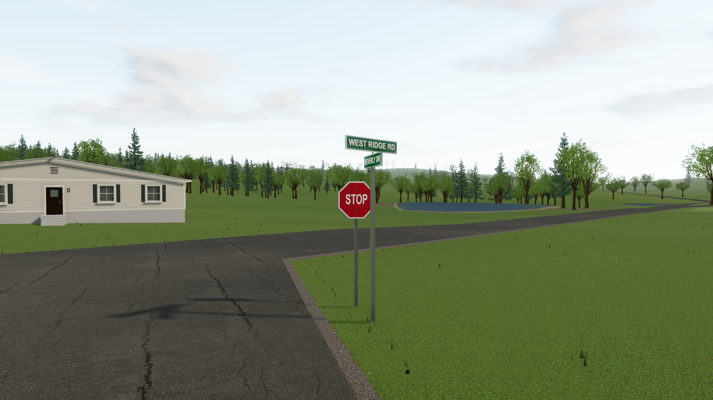

# Beverly driveways and property details

This pass replaces all 37 Beverly driveway strips with individually reviewed pavement outlines, including flared entrances, bends, side courts and parking aprons. The road network and source building footprints remain unchanged. The original annotated pixels, image vintage and confidence are preserved for every observation.

## Home

The earlier 2025-only reconstruction included a short driveway-mouth stub at 2 Beverly. Comparison with official NYS **2010 and 2013 aerials** resolves the curved approach: its entrance is roughly **8m farther south**. The approach is visible in those older images, while evergreen crowns conceal its entrance and middle in 2025. The exposed parking apron in the 2025 image corroborates the destination. Present-day edges under those trees are still an interpretation of dated evidence.

Home now starts on that exposed parking apron, facing the driveway exit. The entire 5.2 × 2.1m visual car footprint fits within the traced pavement, and the property surfaces clear the actual house collision envelopes. The road/driveway geometry follows the same terrain facets as its collider; driveways use paved grip. Small connections between aerial mouths and the retained OSM pavement are separately labeled alignment adjustments.

The parked car keeps its horizontal position while its suspension settles. A pedal press releases the restraint; starting a race, entering the handling grounds or recovering the car also clears it. This prevents slow sideways creep on the approximate driveway grade without changing normal driving physics.

## Property features

The map now includes **12 decks, nine pools and three patios**. Observed pools retain their round, oval, rectangular or irregular outlines. Above-ground pools have sides and uprights; in-ground pools have low coping. Visible covered pools are modeled with covers. Water has restrained ripples and environmental reflections. Decks have individual boards and supports, with rails and stairs only where explicitly specified; visible paving is represented as low patios. Heights and fine construction details cannot be measured reliably from these overhead views and remain approximate. The coarse 30m elevation grid does not resolve individual level pool pads or retaining walls: level water and decks can therefore sit above downhill ground.

Twelve additional dated aerial exports compare numbers 20, 28 and 43 in 2013, 2016, 2021 and 2025. They resolve the exposed poolside terrace at number 28 and corroborate number 20's partially obscured drive. Number 28 now renders two connected wings partitioned from its original L-shaped footprint, keeping its terrace open instead of enclosing it in a large rectangular house collider. The wings share their floor height and appearance and have one generated entrance. Roof intersections remain approximate. See the [dated aerial findings](research-beverly/alternative-aerial-findings.md).

Two additional inspected ground-level listing photographs refine the supported facade colors and details at numbers 12 and 20; eight houses now have photographic facade references. These are dated listing photos, not newly captured Street View. The [photo follow-up](research-streetview/property-followup.md) records the sources and details that the current renderer cannot yet represent.

Vegetation and fine ground cover respect the full pavement and property polygons, including the wide portions beyond the former centerlines. No trees are moved to invent new landscaping: candidates that would put trunks through a drive, deck or pool are omitted.

Both mapped Beverly / West Ridge junctions now have physical US stop signs and two-sided street-name blades. Street names and junction topology are verified. **The exact real sign inventory, locations and stop control were not established**; these are representative junction placements on the right-hand approach, not observations extracted from overhead pixels.

## Review and reproduce

- [Interactive aerial overlay](research-beverly/property-review.html): click an outline for its source and confidence, or use the Home button to inspect the corrected approach.
- [East observations](research-beverly/property-east-observations.json) and [west observations](research-beverly/property-west-observations.json) contain source pixels and local metric coordinates.
- `python docs/research-beverly/annotate-property-east.py` and `python docs/research-beverly/annotate-property-west.py` reproduce the observation JSON from the recorded manual traces.
- `npm run map` compiles the cached observations into the map and manifest without network access.
- `npm run test:property` checks the actual Home departure, neighborhood loop, property views, rendering and environment transitions.

The cached official [NYS imagery services](https://orthos.its.ny.gov/arcgis/rest/services/wms) provide the dated aerial references. Credit: NYS ITS Geospatial Services / NYSDOP. Existing [source terms and limits](beverly-reconstruction.md#sources-and-resource-terms) still apply. Reference images remain in the research cache; the game renders procedural 3D geometry and does not use the aerial as a ground texture.

## Game views

Verification measurements are recorded in [property-verification.json](property-verification.json); see [verification.md](verification.md) for the final test and browser results.
