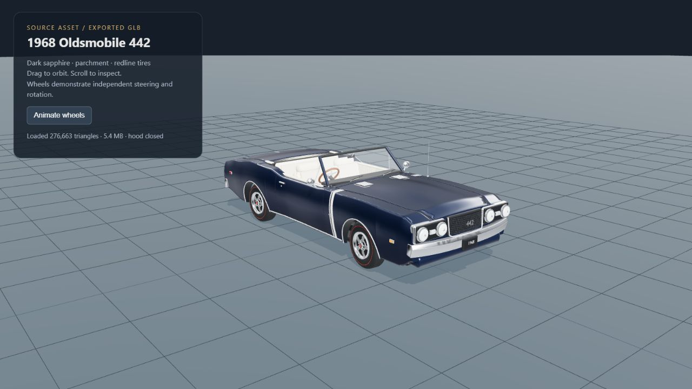

# 442 source and runtime contract

The game uses the supplied, modeled 1968 Oldsmobile 442, not a proxy. The adjacent source README was read and the saved Blender hierarchy inspected before export. The active `oldsmobile_442` folder was treated as read-only. The snapshot used by this project is `asset-source/1968_oldsmobile_442.snapshot.blend`; its SHA-256 is recorded in `public/assets/vehicle-manifest.json`.

Run from the game directory in PowerShell:

```powershell
powershell -ExecutionPolicy Bypass -File scripts/export-car.ps1
# To use a different Blender installation:
powershell -ExecutionPolicy Bypass -File scripts/export-car.ps1 -Blender 'C:\path\to\blender.exe'
```

The script only opens the saved snapshot. It writes `public/assets/oldsmobile-442.glb`, `public/assets/vehicle-manifest.json`, and the derived `asset-source/oldsmobile-442.game.blend`. It never invokes the source rebuild scripts or saves the active source. To incorporate a later source revision, explicitly copy its `.blend` to the snapshot path first, then run the export. Retain the earlier snapshot if it is needed for comparison.

The source is +X left, -Y forward, +Z up, with dimensions in meters. Standard glTF export converts to +X left, +Y up, +Z forward; physical right is -X. Load with GLTFLoader with no additional rotation or scale. The visual origin is at ground level, centered laterally and approximately between axles. A chassis center of mass .65m above the visual origin requires visual position `[0,-.65,0]` beneath its physics body. The suggested collider is independent of visual geometry.

The game export corrects the saved snapshot's interior to US left-hand drive. It inspects the steering wheel's actual location and reflects the interior only when necessary, moving the wheel, column, cluster and pedals together, with the glovebox on the passenger side. Text placement moves without mirroring glyphs, and reflected mesh winding is corrected. Export assertions verify all seven critical interior components. The steering-wheel center is `[+.398,1.038,.064]` in game coordinates, visibly left when looking forward from behind the car. The active source and saved snapshot remain untouched. Physical wheel names are resolved from tire geometry centers, not the snapshot's historically reversed LEFT/RIGHT labels.

| Wheel | Center in exported model (meters) | Steer pivot | Spin pivot |
|---|---|---|---|
| Front left | [.75, .345, 1.43] | WheelSteer_FL | WheelSpin_FL |
| Front right | [-.75, .345, 1.43] | WheelSteer_FR | WheelSpin_FR |
| Rear left | [.75, .345, -1.415] | WheelSteer_RL | WheelSpin_RL |
| Rear right | [-.75, .345, -1.415] | WheelSteer_RR | WheelSpin_RR |

Each wheel has a .345m radius. Animate front steering around local Y (negative angle turns right) and wheel spin around local +X; positive spin angle corresponds to +Z travel. Positive driver input means right; the physics controller performs the sign conversion. Suspension travel moves the steering pivot up/down relative to its manifest center. The nested pivots are intentional: steer the wrapper, then spin its child. Never rotate the combined body to create wheel motion. The root is `Oldsmobile442`, the static body mesh is `Body`.

The exported model has 276,663 triangles, 53 material primitives, 14 nodes, and 21 materials, occupying 5.36 MiB. Source evaluated geometry contained about 745,000 car triangles before export adjustments. The hood is evaluated at authored frame 1 and its animation omitted. The modeled Rocket V8 is retained underneath. Studio floors, backdrop, cameras and lights are excluded.

The final driving integration uses a visual offset of `[0,-.78,0]`, chassis collider half-extents `[.9,.31,2.3]` at `[0,.04,0]`, and four world-down wheel rays from local Y=.1, maximum length1.05m and spring rest ray distance1m. These final values are recorded in `runtimeIntegration` in the manifest and preserved by the export script; the earlier `.65m` values are exporter suggestions. Runtime reads wheel X/Z centers, radius and visual offset from the manifest before creating any vehicle. Car appearance and wheel geometry can therefore be revised without rewriting the input controller or tire-force code.

Optimization is applied only to the derived model: tessellation reduction, merging rigid meshes, reduced bevel/curve subdivisions, and small optical material changes. Dark sapphire base paint, parchment upholstery, chrome, redlines, Rally wheel details, and engine colors remain. Procedural subpixel paint noise is omitted. The windshield uses .20 alpha rather than expensive transmission; headlamps use reflective lenses. This is an artistic visual model, not a dimensionally certified reconstruction.

Browser inspection on September 20, 2026 loaded the actual GLB at 1280×720 in the Codex Chromium browser. Its closed hood, paint, interior, trim and redlines were visually checked. Separate steering/spin wrappers were exercised using the inspection page. There were no JavaScript errors; the isolated development preview emitted a Three.js duplicate-import warning and nonfatal GPU precision warnings. The game uses its own bundled Three.js instance. `docs/vehicle-browser.png` records the actual rendered export.

For development inspection, run the Vite development server and open `/assets/vehicle-preview.html`. This developer page imports installed `node_modules` and is intended for the development server, not the production build.


