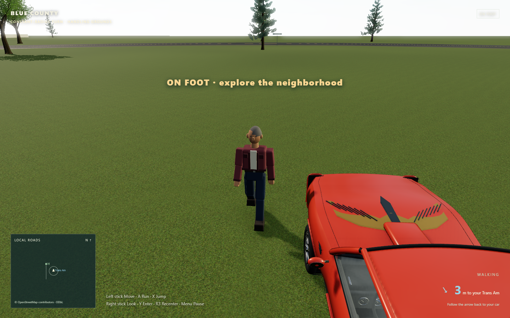
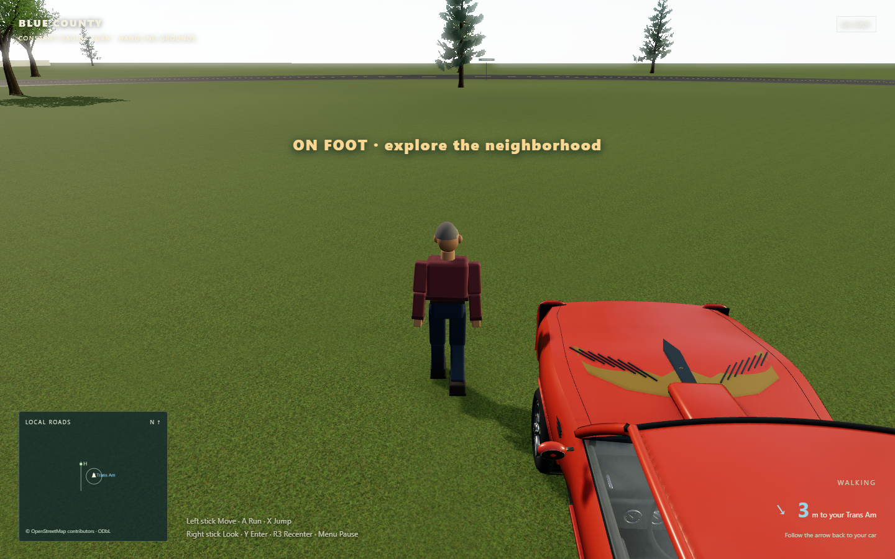

# Walking facing and gait correction

Holding forward could move the character correctly while his visible body faced backward. The problem depended on the parked car's heading, which explains why tests at the normal Home spawn missed it.

The exit animation writes a quaternion to the walking character. Three.js can represent that orientation as XYZ Euler rotations with X and Z at π. Ordinary walking previously changed only Euler Y, retaining the other rotations. It now sets all three components to an upright yaw every frame before applying any active transfer animation.

## Reproduced in the production game

Both screenshots hold the left stick up after the full exit animation from Lou's Trans Am at heading π on the handling grounds. The camera is behind the direction of travel.

| Before: face toward camera while traveling away | After: body faces its travel direction |
| --- | --- |
|  |  |

The [baseline report](walking-facing-before-verification.json) measured a dot product of −0.9959 between actual rendered forward and actual travel (−1 means exactly backward). Previous checks derived facing from physics yaw, so they did not catch a mismatch between the physics and displayed body. The new browser review reads the rendered world transform independently.

## Gait changes

The four provisional buddies now swing each arm against the same-side thigh. Their recovering knees bend backward and their soles remain level. Gait phase follows distance traveled, and the supporting foot moves backward relative to the body at the body's forward speed to reduce visible skating. Joe's authored Blender animation remains unchanged; the root-orientation correction applies to all five drivers.

## Verification

- **218 tests across 28 files** and the production build pass.
- Two new gait regressions failed against the old animation and now pass: counter-swing/recovery and planted-foot stability/clearance.
- The [final browser report](walking-facing-verification.json) covers every member after real exits at 0°, approximately ±97° and 180°, plus gentle stick forward, right, backward, left, keyboard Up and walking after a live camera orbit.
- Input and transfers run through the actual production loop. Developer placement hooks establish repeatable vehicle headings and clear ground; they do not simulate movement. High-refresh render frames are sampled only when physics position changes.

Reproduce with `npm test`, `npm run build`, and `npm run test:walking-facing` while serving the production build at port 5180. `node scripts/walking-facing-check.mjs --before` is reserved for reproducing the old transform defect and intentionally expects backward facing; it should fail on the corrected build.

This fixes the visible direction error and improves the provisional gait. The buddies remain simple articulated placeholders, not motion-captured characters. Synthetic controller checks do not establish the feel of a physical controller or rumble.
